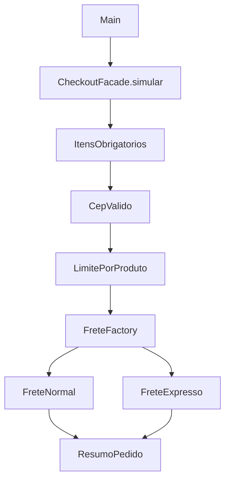

# Patterns Shop

Simulador de checkout em **Java puro**, desenvolvido para praticar padrões de projeto em um domínio pequeno: validar um pedido e calcular seu frete. O projeto roda no terminal, sem Spring, banco de dados ou dependências externas.

## Executar

Requisito: **JDK 17 ou superior** instalado, com `java` e `javac` disponíveis no `PATH`. Não é necessário Maven.

Abra o terminal na pasta do projeto.

**Windows / PowerShell:**

```powershell
.\run.ps1
.\run.ps1 -Test
```

Se a política do PowerShell bloquear o script, execute `powershell -ExecutionPolicy Bypass -File .\run.ps1` para a demonstração ou acrescente `-Test` para os testes. Essa opção vale apenas para o processo iniciado. O script configura a saída em UTF-8 durante a execução para exibir corretamente acentos e valores monetários, restaurando a codificação anterior ao terminar.

**Linux / macOS:**

```sh
sh run.sh
sh run.sh --test
```

Os scripts compilam os fontes em `build/classes` e retornam erro se a compilação ou execução falhar. A suíte usa um executor de testes próprio com verificações explícitas; não depende da opção `-ea`. Os testes não são executados via JUnit ou Maven.

## Demonstração

O programa simula a compra de dois livros a R$ 79,90 e um caderno a R$ 25,00, comparando duas modalidades de frete. Em seguida, demonstra a rejeição de um CEP inválido.

```text
PATTERNS SHOP | Simulação de checkout

NORMAL | Produtos: R$ 184,80 | Frete: R$ 15,00 | Total: R$ 199,80
EXPRESSO | Produtos: R$ 184,80 | Frete: R$ 31,00 | Total: R$ 215,80

Pedido recusado: Informe o CEP com 8 dígitos, com ou sem hífen
```

O espaçamento da moeda pode variar conforme o JDK. Para experimentar outros pedidos, altere os itens ou o CEP em `src/main/java/br/com/patternsshop/Main.java` e execute novamente.

## Regras de negócio

- O pedido deve conter pelo menos um item.
- SKU e nome são obrigatórios; preço e quantidade devem ser positivos.
- Preços usam `BigDecimal` e devem representar centavos exatos. Valores com fração de centavo são rejeitados.
- O CEP aceita oito dígitos, com ou sem hífen: `01001000` ou `01001-000`. A validação é apenas de formato; não consulta a existência do endereço.
- Cada SKU pode somar até dez unidades por pedido. Linhas repetidas do mesmo SKU são somadas. O SKU diferencia maiúsculas de minúsculas.
- Frete normal: R$ 15,00 para subtotal menor que R$ 200,00; gratuito a partir de R$ 200,00.
- Frete expresso: R$ 25,00 mais R$ 2,00 por unidade, sem isenção.
- Total = subtotal dos produtos + frete.

As tarifas são fictícias e servem ao exercício. O programa apenas simula o checkout: não reserva estoque, cobra pagamentos ou persiste pedidos. Os preços recebidos são dados de entrada do exemplo; uma aplicação real deveria obtê-los de um catálogo confiável.

## Padrões aplicados

| Padrão | Implementação | Responsabilidade |
| --- | --- | --- |
| Chain of Responsibility | `ValidacaoPedido`, `ItensObrigatorios`, `CepValido`, `LimitePorProduto` | Cada elo verifica uma regra e encaminha o pedido; uma falha interrompe a cadeia. |
| Strategy | `CalculadoraFrete`, `FreteNormal`, `FreteExpresso` | Encapsula algoritmos de frete intercambiáveis por um contrato comum. |
| Simple Factory | `FreteFactory` | Centraliza a seleção e criação da estratégia a partir da modalidade. |
| Facade | `CheckoutFacade` | Expõe `simular(pedido)` e coordena validação, frete e resumo. |

**Precisão conceitual:** Simple Factory é uma técnica de criação comum, mas não é o padrão GoF Factory Method, que usa um método de criação redefinido por subclasses. Os outros três padrões da tabela pertencem ao catálogo GoF.



O diagrama representa a sequência coordenada pela facade; o último validador retorna à facade antes da seleção do frete. A ordem das validações define qual mensagem aparece primeiro quando há mais de um erro.

## Organização

```text
src/main/java/br/com/patternsshop/
  Main.java                 # Exemplo executável
  model/                    # Dados imutáveis do pedido e resumo
  validation/               # Cadeia de validações
  shipping/                 # Estratégias e fábrica de frete
  service/                  # Facade do checkout
src/test/java/br/com/patternsshop/
  CheckoutTest.java          # 19 cenários automatizados
run.ps1                     # Compilar, executar ou testar no Windows
run.sh                      # Compilar, executar ou testar em Linux/macOS
```

Os objetos de domínio são records e o pedido faz uma cópia imutável da lista de itens. As regras locais de construção ficam nos records; as regras de aceitação do pedido ficam na cadeia. A cadeia é montada pelo construtor padrão da facade e também pode ser fornecida pelo construtor alternativo.

## Testes

A suíte verifica os limites do frete gratuito (R$ 199,99, R$ 200,00 e R$ 200,01), cálculo do expresso por unidade, precisão decimal, campos obrigatórios, CEP, carrinho vazio, limite por SKU com linhas repetidas, proteção da lista de itens, seleção da estratégia e interrupção da cadeia na primeira falha. Uma falha gera `AssertionError` e encerra o processo com erro.

Validação realizada no Windows com JDK 21, compilando para Java 17 via `--release 17`. O script de Linux/macOS é fornecido, mas não foi executado nesse ambiente.

## Como evoluir

1. **Adicionar retirada na loja:** crie uma implementação de `CalculadoraFrete`, adicione a modalidade ao enum e registre a seleção na factory. Acrescente um teste de total sem frete.
2. **Adicionar uma regra de pedido:** estenda `ValidacaoPedido` e insira o elo na cadeia, escolhendo a prioridade de sua mensagem de erro.
3. **Expor uma API:** reutilize a facade em uma camada HTTP, traduzindo dados de entrada e erros para respostas apropriadas.

A factory usa um `switch` explícito: uma nova modalidade exige alterá-la. Isso mantém a seleção fácil de ler para o tamanho do exercício. Os padrões adicionam classes e indireção; sua utilidade aqui está em permitir variar regras e cálculos sem concentrar tudo em `Main`.

## Entrega no GitHub

Crie um repositório vazio na sua conta e, nesta pasta, execute os comandos abaixo. Substitua `URL_DO_SEU_REPOSITORIO` pela URL real. O projeto local não publica nada automaticamente.

```sh
git init
git add .
git commit -m "Adiciona simulador de checkout com padrões de projeto"
git branch -M main
git remote add origin URL_DO_SEU_REPOSITORIO
git push -u origin main
```

Descrição sugerida para a entrega:

> Simulador de checkout em Java puro com Chain of Responsibility, Strategy, Simple Factory e Facade. Inclui validação de pedidos, duas modalidades de frete, objetos imutáveis e 19 cenários automatizados, com execução sem dependências externas.
